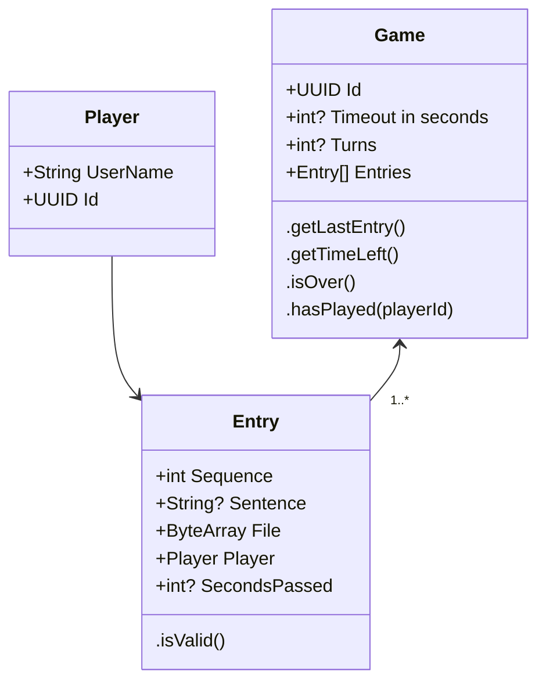
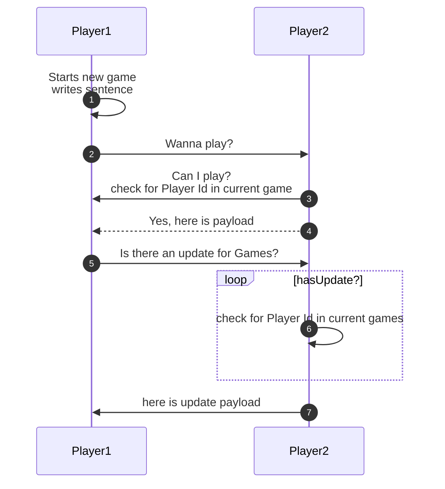
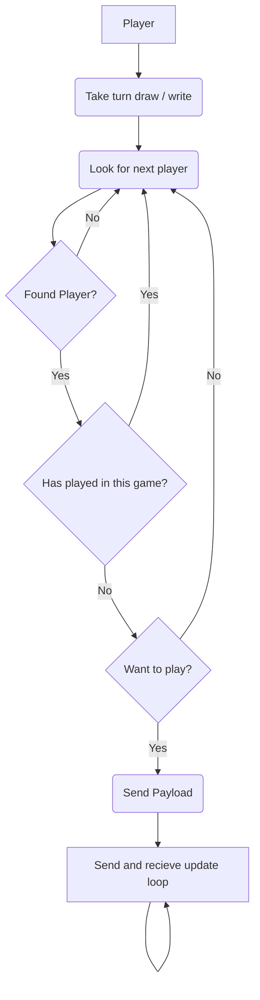

# Eat Poop You Cat for Android

## Premise

Eat Poop You Cat is a bit like telephone meets Pictionary:tm: where you start with a sentence pass it to the next person and it they draw a picture. Then they pass it to the next person and they can only see the last entry (picture in this case) and they write a sentence. It goes on until everyone has had a turn or boredom takes hold.

### Info Needed from user

*   Display Name

### Rules

*   Each person can only play once per Unique game 
*   only Monochrome drawings
*   Time Limit
*   Turn limit

### Permissions needed

```none
android.permission.BLUETOOTH
android.permission.BLUETOOTH_ADMIN
android.permission.ACCESS_WIFI_STATE
android.permission.CHANGE_WIFI_STATE
android.permission.ACCESS_COARSE_LOCATION
android.permission.ACCESS_FINE_LOCATION
android.permission.ACCESS_BACKGROUND_LOCATION
android.permission.BLUETOOTH_SCAN neverForLocation
android.permission.BLUETOOTH_ADVERTISE
android.permission.BLUETOOTH_CONNECT
```

*   these are needed to connect using Nearby Connections and will not be used for anything else. No data sent by the core app

### Tech used

*   [nearby connections](https://developers.google.com/nearby/connections/overview) to send and receive data
*   [ORM - Room](https://developer.android.com/training/data-storage/room/)
*   [Wireframes - Figma](https://www.figma.com/file/N5rf2UZaGy0LhD4S7r28OI/EPYC?node-id=0%3A1)

### Data



### Sequence



### Flow


