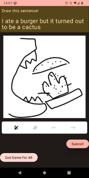
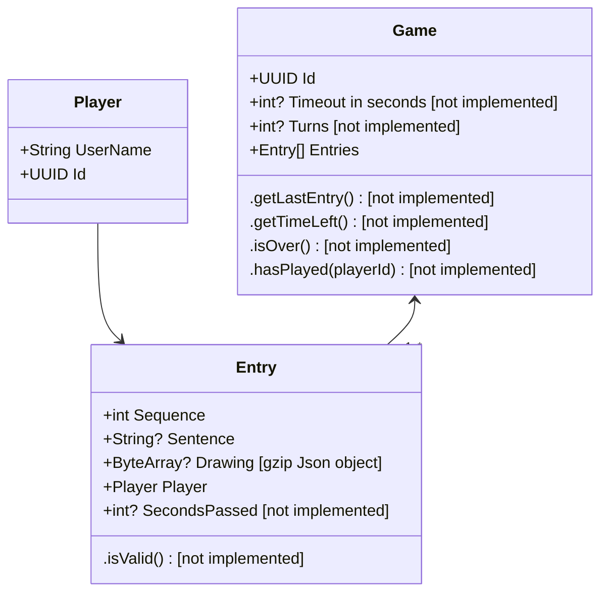
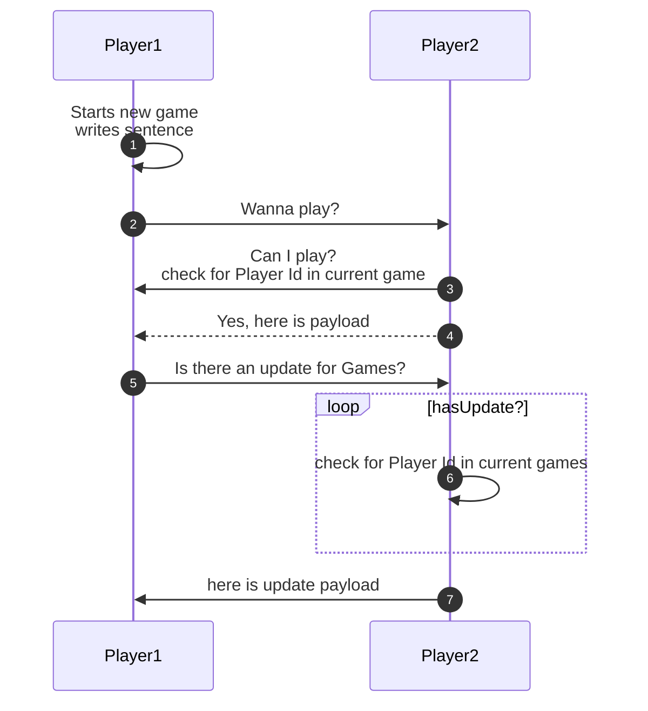
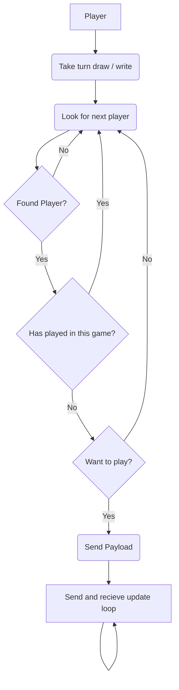

# Eat Poop You Cat for Android

## Status

[]()

[](https://www.codacy.com?utm_source=github.com&amp;utm_medium=referral&amp;utm_content=JamesOsborn-SE/eat-poop-you-cat-android&amp;utm_campaign=Badge_Grade)

[](https://github.com/JamesOsborn-SE/eat-poop-you-cat-android/actions/workflows/android.yml)

[](https://github.com/JamesOsborn-SE/eat-poop-you-cat-android/actions/workflows/android-package.yml)

[]()

## Premise

Eat Poop You Cat is a bit like telephone meets Pictionary:tm: where you start with a
sentence pass it to the next person and it they draw a picture.
Then they pass it to the next person and they can only see the last entry
(picture in this case) and they write a sentence. It goes on until
everyone has had a turn or boredom takes hold.

## Screenshots

[](/images/Screenshot-Welcome_Screen.png)
[](/images/Screenshot-Sentence_Screen.png)
[](/images/Screenshot-Draw_Screen.png)
[](images/Screenshot-Draw_the_sentence.png)

### Info Needed from user

* Display Name

### Rules

* Each person can only play once per Unique game
* only Monochrome drawings
* ~~Time Limit~~
* ~~Turn limit~~

### Permissions ~~needed~~

**No** permissions needed at the moment but future plans include:

```none
android.permission.BLUETOOTH
android.permission.BLUETOOTH_ADMIN
android.permission.ACCESS_WIFI_STATE
android.permission.CHANGE_WIFI_STATE
android.permission.ACCESS_COARSE_LOCATION
android.permission.ACCESS_FINE_LOCATION
android.permission.ACCESS_BACKGROUND_LOCATION
android.permission.BLUETOOTH_SCAN neverForLocation
android.permission.BLUETOOTH_ADVERTISE
android.permission.BLUETOOTH_CONNECT
```

* these are needed to connect using Nearby Connections and will not be used for anything else. No data sent by the core app

### Tech used

* ~~[nearby connections](https://developers.google.com/nearby/connections/overview) to send and receive data~~
* [ORM - Room](https://developer.android.com/training/data-storage/room/)
* [Wireframes - Figma](https://www.figma.com/file/N5rf2UZaGy0LhD4S7r28OI/EPYC?node-id=0%3A1)

### Run locally

* Install the latest [Android Studio](https://developer.android.com/studio/)
* Enable developer tools on a physical device or make a new virtual device in Android Device Manager [Run your app](https://developer.android.com/studio/)

### Data



### Sequence [not implemented]



### Flow [not implemented]



## Disclaimer

This app is not by indorsed or related to Pictionary:tm: or Mattel in anyway.
