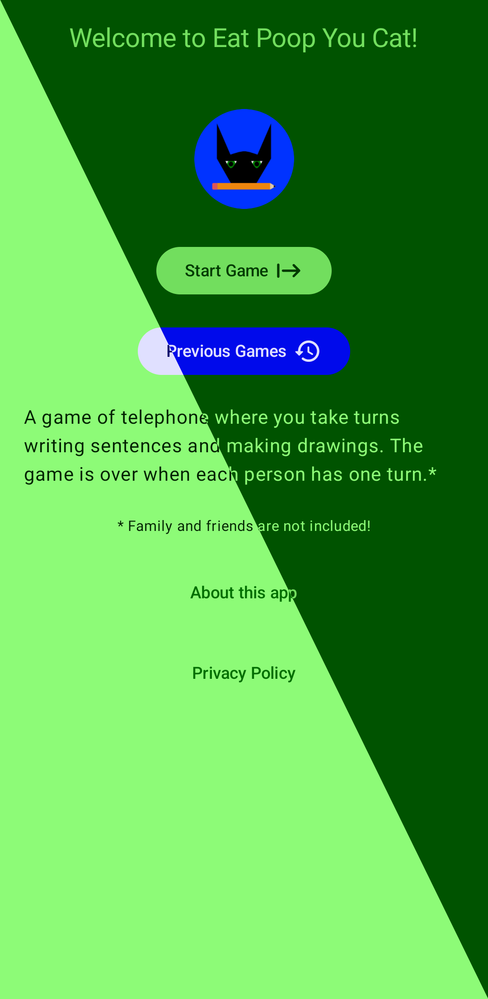
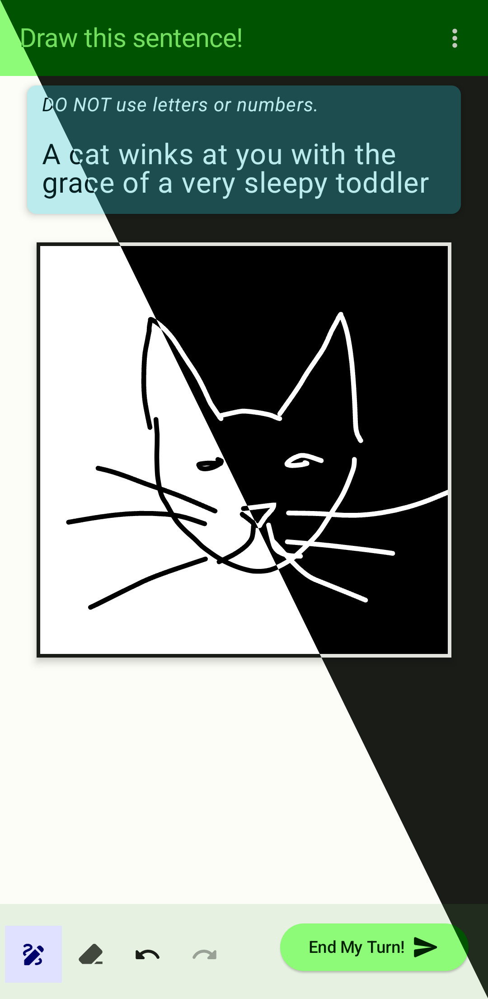
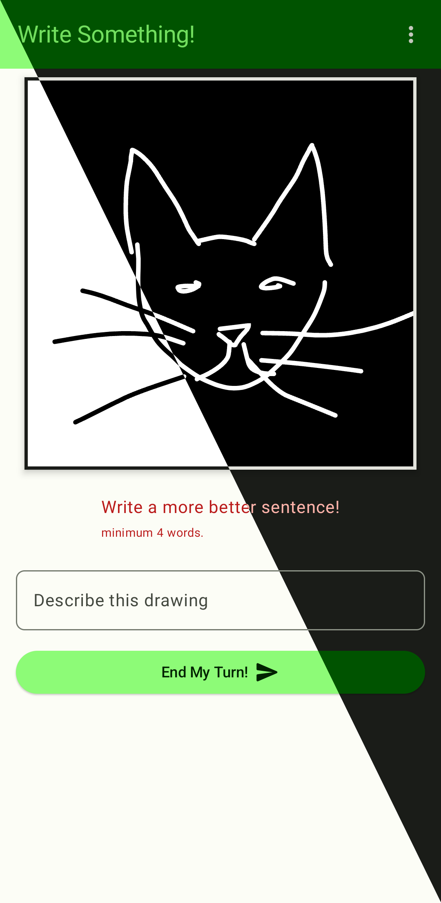

# Eat Poop You Cat for Android

## Status

## Premise

Eat Poop You Cat is a bit like telephone meets that one game where you try to get folks to guess the drawing.

You start with a sentence pass it to the next person and it they draw a picture. Then they pass it to the next person and they can only see the last entry (picture in this case) and they write a sentence. It goes on until everyone has had a turn or boredom takes hold.

## Screenshots

|                                                                  |                                                                     |                                                                      |                                                                     |
|------------------------------------------------------------------|---------------------------------------------------------------------|----------------------------------------------------------------------|---------------------------------------------------------------------|
|  |  |  |  |
|                                                                  |                                                                     |                                                                      |                                                                     |

### Info Needed from user

* Display Name

### Rules

* Each person can only play once per Unique game
* only Monochrome drawings

### Permissions

* **No** permissions needed

## Translation Status

## Contributors

AKA the Kool Kids 😎

### Tech used

* [ORM - Room](https://developer.android.com/training/data-storage/room/)
* [Wireframes - Figma](https://www.figma.com/file/N5rf2UZaGy0LhD4S7r28OI/EPYC?node-id=0%3A1)

## Dev Stuff

### Run locally

* Install the latest [Android Studio](https://developer.android.com/studio/)
* Enable developer tools on a physical device or make a new virtual device in Android Device Manager [Run your app](https://developer.android.com/studio/)

### Data

## Get it on!

